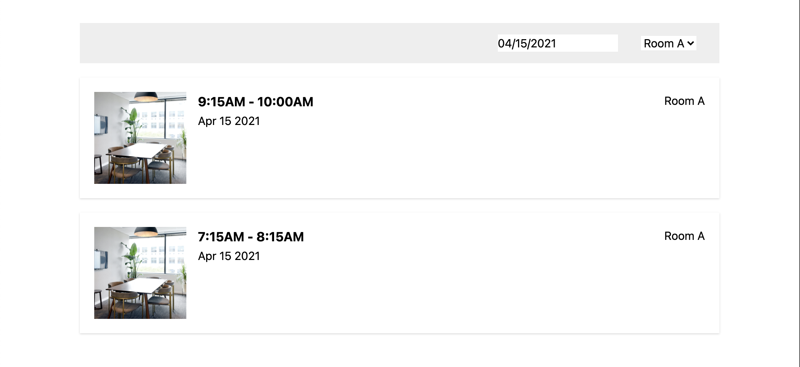
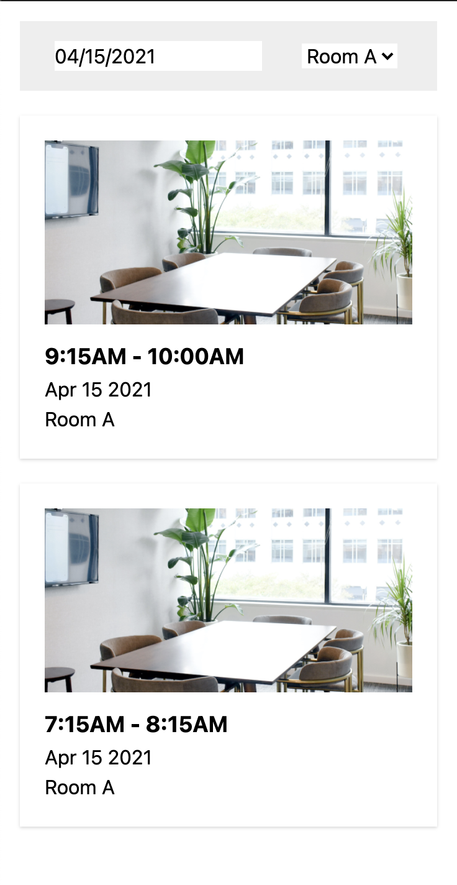

# coding-challenge-front-end

Welcome to the Cove coding challenge! 👋

Adam just signed a deal with a large real estate owner 🎉. Before we can launch our *powered by cove* platform in their office building, we need to get a reservation system up and going. 

In our backlog grooming Jeremy (our Product person) presented the problem we are trying solve for our users:

*As Angela at Allsafe (office user), I’d like to book a the large conference room for the strategy meeting and I need to find a time when it's avaiable.*

The team broke this problem down and decided to start first with this User Story:
- As an office user, I’d like to see the schedule for a selected room and date, because I need to find a time when it's available.

For this challenge, we've provided you with a simple application that is meant to display a list of reservations and allows the user to filter by date and room. Your job is to complete this application so that it functions as intended.

Questions along the way? Don't hesitate to reach out to engineering@cove.is!

## Running the App

- `yarn`
- `yarn start`

## Part 1

Your first objective is to take a look at the TODOs in [`App.js`](./src/App.js) and "wire-up" the existing components. No need to change the UI at this stage in terms of styling or functionality, apart from hooking up the components.

We'd like you to use hooks for this section. Specifically we'd like you to use the `useMemo` hook in your solution. If you don't know what this hook is you can read about it [here](https://reactjs.org/docs/hooks-reference.html#usememo).

You'll need to:
- manage the state for both filters (`DatePicker` & `DropDownSelect`)
- fetch a list of reservations from this endpoint: https://cove-coding-challenge-api.herokuapp.com/reservations
- populate `DropDownSelect` with options based on the rooms you get back from the endpoint (e.g. "Room A", "Room B", ...)
- pass a filtered version of the reservations you get back to `ReservationList`

After this step, the user should be able to change the value of both filters, and they should only see reservations that match their filters.

### Explain your approach to Part 1

- Use the useState hooks to manage the states of the mentioned components.
- Install and use axios to make the api call.
- Architect the code between folders to make it more readable.
- Perform the necessary filters using vanila.
- Send the reservation array to the ReservationsList component with some filtered reservations. 
- I just use useMemo to make the api call only once.
- Notes: 
    - useMemo is calling twice the endpoint.
    - useEffect is better here because calls one time.
    - useMemo is not a good practice to call an endpoint. But I cant found a way to use useMemo hook mentioned in the documentation.

## Part 2

Your next job is to make the list of reservations look a little nicer. Ryan, the designer on our team made some mock-ups for the desktop and mobile UI. Take a look at the TODO in [`ReservationList.js`](./src/ReservationList.js) and try to match Ryan's mock-ups below. Your design should be responsive, using a css breakpoint to switch between the desktop and mobile layouts. 

Desktop:

Mobile:

Please don't worry about making it a pixel-perfect match with the designs! As Devs we collaborate closely with Ryan and it's a give and take.

Feel free to use whatever approach to styling you wish. No need to mirror what is already in the project. Some approaches that we consider valid:

- [Styled Components](https://styled-components.com/)
- [React-JSS](https://cssinjs.org/react-jss/?v=v10.6.0)
- [Tailwind](https://tailwindcss.com/)
- SASS/LESS
- CSS Modules
- or just plain CSS

### Explain your approach to Part 2

- Just design the ReservationsList component following mockups.
- I tried to install tailwind css but with the create-react-app 4 version there are some compatibilty problems and I needed to switch to @craco, so I decided to continue with just css.

## Part 3

For this last step, we'd like to try and understand how you approach testing. Our product person Jeremy already has a bunch of reservations related User Stories lined up. In the backlog grooming, Wil pointed out that we should add some good test coverage now, since we'll likely add more complexity to our reservation app in the future.

We've started working on a util called `isScheduleConflict` to check for reservation conflicts. `isScheduleConflict` takes a list of reservations and returns `true` if any reservation in the list conflicts with another in the list (see `utils.js` for more details). Your job is to complete this util and add more test coverage. Look for the TODOs in [`utils.js`](src/utils.js) and [`utils.test.js`](src/utils.test.js) and use `yarn test` to execute the tests.

Assumptions you can make:
- `reservations` will always be an array of valid reservations
- A valid reservation always has a start/end time and the end time will always be after the start time
- Do NOT hook up the util to the user interface

NOTE: Don't worry about the efficiency of your solution:
- If you know an efficient solution, we'd love to see it and hear why you favor it.
- However, we are more focused on readable and maintainable code.

### Explain your approach to Part 3

- Mock some reservations (with conflict, no conflicts, large list with conflicts)
- Develop the function to see if exists conflict in a list of reservations
- Add some new test cases

## One last thing...

Write up a few notes about your approach to each Part in the README sections above. Finally, search the repo for `TODO:`. If you see no search results, then you are done! 👏
